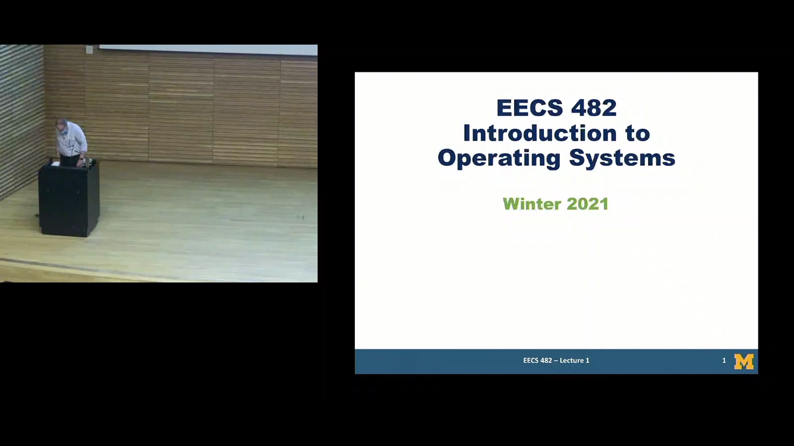

# Welcome to the Caen Downloader Repo!

**Table of contents:**
---
> 1. [About Caen Downloader](#about)  
> 2. [Getting Started](#gettingStarted)
> 3. [Future Work](#futureWork)
---


<a name="about"></a>
## About Caen Downloader
Caen Downloader is a lightweight python utility that downloads recorded lecture videos from the [University of Michigan leccap website](https://leccap.engin.umich.edu/leccap/).


This project was originally developed for bulk downloading of lectures for archival purposes and, like many of my projects, was intended to be a reverse engineering learning experience. As such, the project implements a lightweight interface to support dual-factor Duo authentication and is by no means complete and isn't guaranteed to work with future updates. Currently Caen Downloader has been tested to work with Duo authentication v4 phone calls and sms passcodes. For a more robust and future proof solution the project can be modified to work with [Duo's python client](https://github.com/duosecurity/duo_client_python/tree/master)     
 
As it stands there are a handful of todo's and feature's I may get around to implementing if have the time, but the project is in a 'good enough' state to use as of now. Let me know if you'd like me to add any new features or maintain the project and I'd be happy to do so!

An example screenshot of a recorded lecture video


<br>

<a name="gettingStarted"></a>
## Getting Started
First use the following commands to clone the repo and change your working directory to the project if you haven't already done so 
```bash
    git clone https://github.com/samrg123/Caen-Downloader.git
    cd ./Caen-Downloader
```

Caen Downloader is lightweight, but still relies on a few libraries for html parsing and password input. Before using Caen Downloader for the first time make sure all the python libraries are installed by executing the following command.
```bash
    pip install -r ./requirements.txt
```

Once everything is installed you can execute the following command to download all of your lecture recordings to the current working directory
```bash
    py ./caenDownloader.py
``` 
> Note: Each lecture recording is ~700MB so downloading all videos is not advised unless you have sufficient disk space and internet data.

You can also use the following command line arguments with Caen Downloader. 
```bash
./caenDownloader.py [-h] [--dir str] [--list] [--start int] [--stop int] [--verbose int]

  -h, --help     show this help message and exit
  --dir str      Specifies the directory to output downloaded recordings to. Default [str] = './recordings'
  --list         Lists available courses to download Default = 'False'
  --start int    Specifies the year to start parsing courses. Default [int] = '2006'
  --stop int     Specifies the year to stop parsing courses. Default [int] = '2024'
  --verbose int  Specifies the verbose level. Larger values enable more verbose output. Default [int] = '1'
```
> Note: It may be a good ide to run `./caenDownloader.py --list` to see what courses are available before downloading so you can pick a good `--start` and `--stop` year and avoid downloading videos you don't need. 

<br>

<a name="futureWork"></a>
## Future Work
In no particular order:
- Add support for filtering course name and recording titles with regex to only. (Example: only download videos that match "EECS*" courses or "Section 1")
- Add an `--update` option that only downloads files if it doesn't already exist in output directory
- Add support to download captions and convert them to a srt file saved alongside video
- Ability support for downloading thumbnails
- Add multi-threading support for parallel downloads
- Figure out waveform.audiomap is used for and if it's useful
- Add ability to download files from CAEN computer accounts 
- Have `--list` report the number of bytes that will be downloaded

